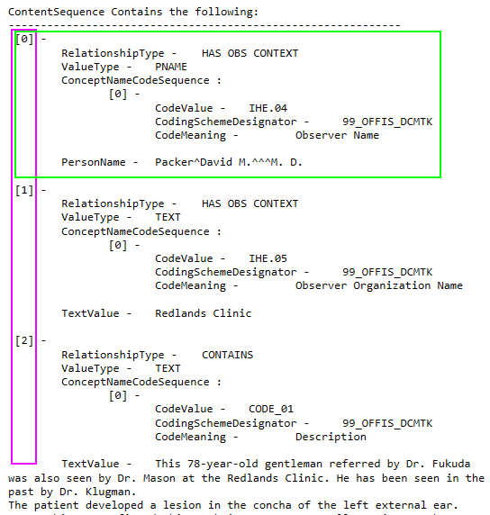
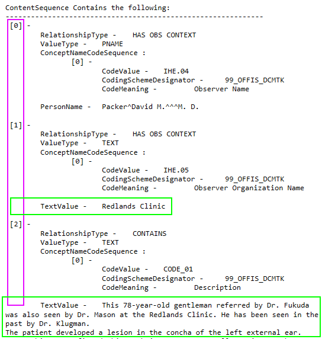
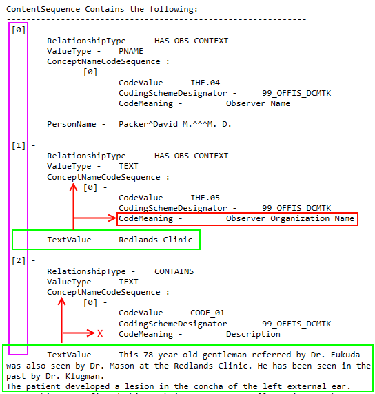
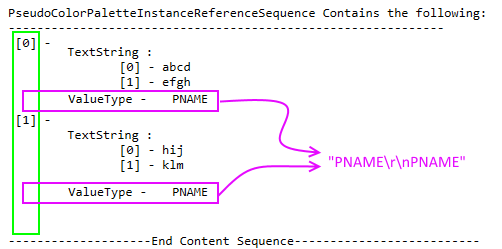
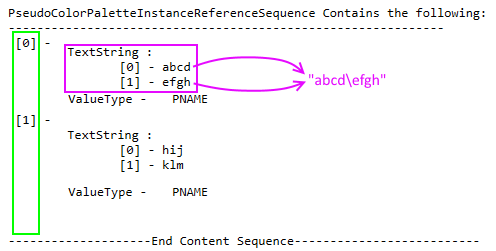
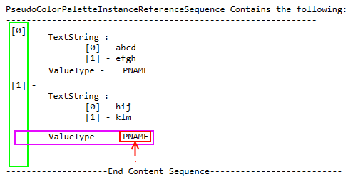
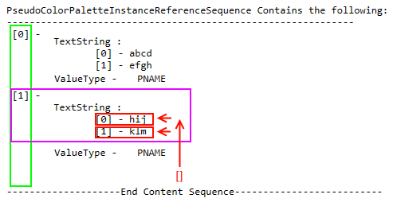
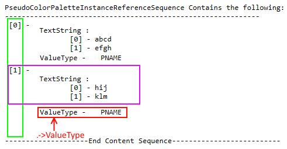
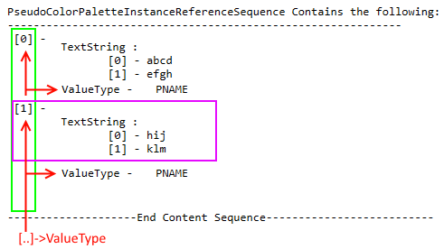
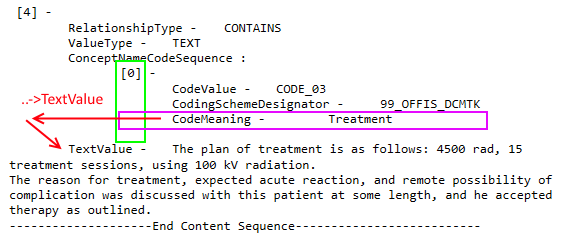

# Tag Elevation

Primary Author: [Thomas](https://github.com/tznind)

## Contents
1. [Background](#1-background)
1. [Tag Elevation](#2-tag-elevation)
1. [Conditional](#3-conditional)
1. [Elevation Operators](#4-elevation-operators)
1. [Conditional Operators](#5-conditional-operators)
 
## 1. Background

Tags in the Dicom specification can be Sequences (See http://dicom.nema.org/Dicom/2013/output/chtml/part05/sect_7.5.html).  Sequences comprise 1 or more sub datasets.  A DicomTag is either a Sequence or a Non Sequence (See test `AreSequenceTagsAmbiguous`).

The following example (From http://www.dclunie.com/medical-image-faq/html/index.html) shows how we represent Sequences in our data model:



* The purple box shows the contents of top level tag ContentSequence
* ContentSequence has 3 sub datasets ([0], [1] and [2]).
* Each sub dataset (shown in green) is a full dicom dataset which means it:
	* can include other Non Sequence tags (e.g. PersonName) 
	* can include further sequences (e.g. ConceptNameCodeSequence).

## 2. Tag Elevation

It is a relatively easy task to enumerate the top level tags in a dicom image and persist them (e.g. to a database).  What is a lot harder is to identify relevant content burried in sub sequences and promote it so that it is more easily queryable.

`TagElevator` is the class that handles specifying rules and conditions for promoting burried tags.  Unit tests for the class are in `TagElevatorTests`.

The core principle is the specification of a tag hierarchy that identifies the final end tag(s) you are interested in:

```
 "ContentSequence->TextValue" 
```

In order to be a valid pathway there must:
* Be at least 2 tags
* The last tag cannot be a Sequence
* All preceeding tags must be Sequence tags
* Because each Sequence returns an array of dicom datasets it is possible to match multiple final tags (See Example)

### Elevation Example

Consider the pathway

```
 "ContentSequence->TextValue" 
```

This translates to 
1. From the root dicom file open the tag called ContentSequence
2. For each matching sub array element return TextValue

This is illustrated below by the green boxes.  Notice that although the first element [0] is examined since it is a child of ContentSequence no matching child tag `TextValue` is found



## 3. Conditional

Fetching all `TextValue` tags in the `ContentSequence` root tag is not terribly useful.  It would be far better if we could say:

```
Get the `TextValue` tag in `ContentSequence` but only where there is also a sibling tag `ConceptNameCodeSequence->CodeMeaning` with the value "Observer Organization Name"
```



This is done by specifying a 'Conditional pathway' and a Regex pattern to match the final value on.  The pathway always takes the following form:

```
[relative operator]->[Sequence 1]->[Sequence etc]->[Final Non Sequence Tag]
```

The relative operator tells the API where to start searching (e.g. siblings, up one tag, up two tags etc).  The (optional) Sequence tags are then traversed and the final value(s) read for the final (Non Sequence) tag.

For example
```csharp
Elevation Pathway:
"ContentSequence->TextValue" 

Relative Conditional Pathway:
".->ConceptNameCodeSequence->CodeMeaning"

Condition Regex:
"Observer Organization Name"
```

To see how this is interpreted look at test `TagElevation_TwoDeepWithConditional_FindValue`

### 4. Elevation Operators

#### 4.1 Concatenate Matches



Allows the pathway to matching multiple final leaf tags.  This happens when a Sequence in the chain has mutliple datasets in it containing the tags of interest (matched by your path).  If you append `+` to the end of your pathway then the resulting tag values will be concatenated with splitter `ConcatenateMatchesSplitter`.  If you do not specify `+` and multiple matching leaf tags are found then a `TagNavigationException` is thrown.

| Symbol        | Pathway       | Test/TestCase |
| ------------- | ------------- | --------------|
| +  | Elevation |`TagElevation_ThreeDeep_FindValue` |


#### 4.2 Concatenate Multiplicity



Allows final tag(s) to have multiplicity i.e. the final tag can have an array representation (this is not the same as a Sequence!).  If you append `&` to the end of your pathway then the resulting array values will be concatenated with splitter `ConcatenateMultiplicitySplitter`.  If you do not specify `&` and leaf tags contain multiplicity then a `TagNavigationException` is thrown.

Note that this operator does not require leaf nodes to have or even support multiplicity (See `TagElevation_MultiplicityOperatorWhenNoMultiplicity`).


| Symbol        | Pathway       | Test/TestCase |
| ------------- | ------------- | --------------|
| &  | Elevation | `TagElevation_Multiplicity` |

### 5. Conditional Operators

#### 5.1 Dot Conditional



Condition should be checked on the final tag value(s) only

| Symbol        | Pathway       | Test/TestCase |
| ------------- | ------------- | ------------- |
| .  | Conditional |  `TagElevation_ConditionalCurrentNode` |

#### 5.2 Multiplicity Conditional



Works the same as '.' (scope is the final matching leaf tags only).  But if the final tag value(s) have multiplicity then only the elements that match the pattern are returned

| Symbol        | Pathway       | Test/TestCase |
| ------------- | ------------- | ------------- |
| []  | Conditional |  `TagElevation_Multiplicity_Conditional` |


#### 5.3 Dot Pathway Conditional



Condition is checked against another tag which appears in the same Sequence dataset as the final tag.  This can include tags which have subsequences

| Symbol        | Pathway       | Test/TestCase |
| ------------- | ------------- | ------------- |
| `.->NonSequenceTag`  | Conditional |  `TagElevation_ConditionalCurrentNode_OtherTags` |
| `.->SequenceTag->SequenceTag->etc->NonSequenceTag`  | Conditional |  `TagElevation_TextValueConditionals_FindValue` |


#### 5.4 Double Dot Array Pathway Conditional



Condition is checked against other tags which appear in the same Sequence dataset (Like `.->Tag`) but also checks the other datasets that are siblings in the current sequence dataset (array buddies!)

| Symbol        | Pathway       | Test/TestCase |
| ------------- | ------------- | ------------- |
| `[..]->NonSequenceTag` | Conditional | `TagElevation_SiblingConditionals`|
| `[..]->SequenceTag->SequenceTag->etc->NonSequenceTag` | Conditional |`TagElevation_SiblingConditionals`|

#### 5.5 Double Dot Pathway Conditional



Condition is checked against the parent Sequence dataset (array element) which contains the final tag sequence.  This requires that the pathway has at least 2 sequence tags before the final non sequence tag.

Note in the above picture the pathway being considered is `ContentSequence->ConceptNameCodeSequence->CodeMeaning` with the relative conditional `..->TextValue`.  The final sequence (which contains the Non Sequence final tag `CodeMeaning`) is `ConceptNameCodeSequence`.  The `..` operator makes the match evaluator look in the parent array element (`[4]`) of the parent sequence `ContentSequence`.

| Symbol        | Pathway       | Test/TestCase |
| ------------- | ------------- | ------------- |
| `..->NonSequenceTag` | Conditional | `TagElevation_DoubleDotConditional_FindValue`|
| `..->SequenceTag->SequenceTag->etc->NonSequenceTag` | Conditional |`TagElevation_DoubleDotConditional_FindValue`|


Note that when elevating `ContentSequence->ConceptNameCodeSequence->CodeMeaning` the conditional `[..]->X` is the same as `..->ConceptNameCodeSequence->X`

#### 5.6 Combining

You can combine the `..` and `[..]` operators (See test `TagElevation_DoubleDotConditional_ThenArrayElementBuddies_FindValue`).  But bear in mind that your pathways down (`->`) always travel every array element in every sequence encountered.  This means that when elevating with path `A->B->Leaf` with match conditional `..->B->Leaf` is not the same as `.` (or even `.->Leaf`) because there can be many datasets below A of which many can have subsequence tag B.  For example:

```
A-> [0] B->Leaf
	[1] B->Leaf
		C->D->Leaf
```